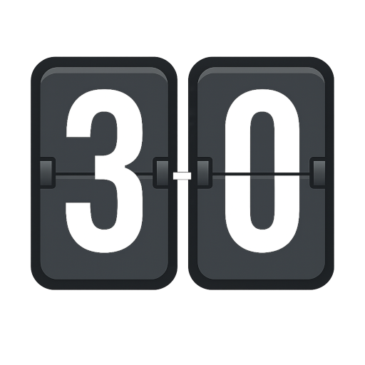
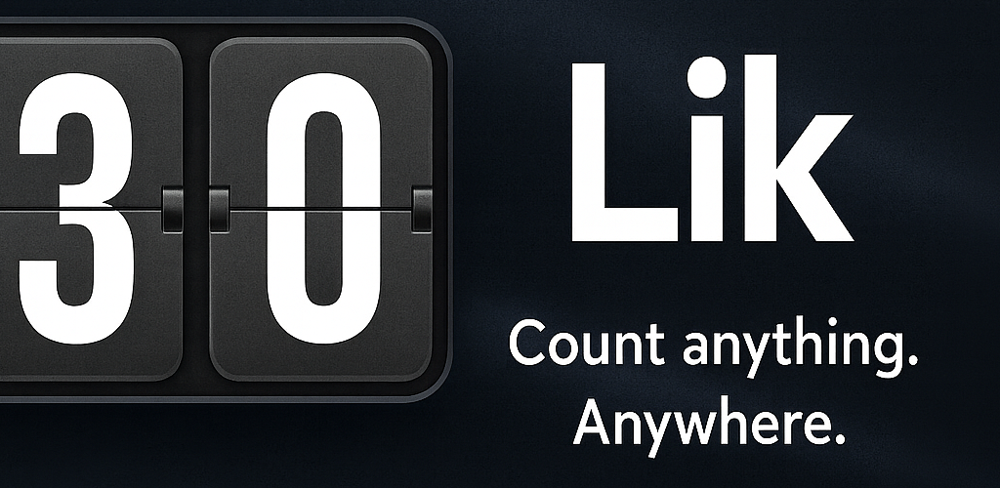

# Lik — Encrypted, real‑time scoreboards over Nostr

Collaborative scoreboards you can share with a QR code, sync in real time across devices, and keep end‑to‑end encrypted. Built with Vue 3 + Vite, powered by Nostr relays, and packaged for Android with Capacitor.

 

<a href="https://play.google.com/store/apps/details?id=io.devforth.lik&hl=en"><b>Get it on Google Play</b></a>

 
 

## Highlights

- Real‑time collaborative scoreboards (CRDT‑based) that converge across peers
- End‑to‑end encryption (AES‑GCM) for board metadata, join requests, and snapshots
- Easy invite and onboarding via share code and QR (format: `lik::<id>::<secret>`)
- Owner‑approved editors; guests see read‑only until approved
- Offline‑friendly: local state in IndexedDB with automatic persistence
- Android app (Capacitor) + PWA, responsive UI with Tailwind

	

  You can see live screenshots on the Play Store listing: https://play.google.com/store/apps/details?id=io.devforth.lik&hl=en

## Features

- Scoreboards
	- Create multiple boards; add, rename, and reorder categories
	- Add/rename/remove participants
	- Increment/decrement per‑participant scores per category
	- One‑tap “priority/star” per category using a CRDT shadow counter (`::prio`)
- Sharing & access control
	- Share code & QR: `lik::<boardId>::<secret>`
	- Owner receives encrypted join requests and can approve editors
	- Non‑approved users have read‑only access after scanning the QR
- Security & privacy
	- End‑to‑end encrypted join requests, board metadata PRE (`lik::brd::<id>`), and CRDT snapshots (`lik::crdt::<id>`) using AES‑GCM
	- Secret is derived locally and never published to relays
	- Local storage only: IndexedDB holds boards, snapshots, secrets, and minimal caches
- Nostr integration
	- Uses public relays with `nostr-tools` SimplePool
	- Profiles (kind 0) published/de‑duplicated per relay; avatars generated locally
	- PREs (kind 30078) carry encrypted board metadata and CRDT snapshots
- UX niceties
	- Top‑of‑screen activity toasts for remote edits
	- Backup reminders for your private key (nsec), key reveal & import
	- Mobile camera QR scanner with graceful fallback to manual entry

## Architecture (brief)

Tech stack
- Vue 3 + TypeScript + Vite (`src/`)
- Pinia for state stores (`src/stores/*`)
- Tailwind CSS + Reka UI + Vaul for the UI
- Nostr via `nostr-tools` SimplePool (`src/nostr.ts`)
- Capacitor for Android packaging (`capacitor.config.ts`, `android/`)

Data & persistence
- IndexedDB via a small wrapper (`src/lib/idb.ts`)
	- Stores: `user`, `scoreboards`, `profiles`, `rejectedScoreboardRequests`
- No server/database: Nostr relays are used as the transport and durable broadcast channel

End‑to‑end encryption
- Each board has a symmetric secret: `sha512Hex("${ownerPrivHex}::${boardId}")`
- What’s encrypted with that secret:
	- Join requests (kind 1 note content)
	- Board metadata PRE: `d = lik::brd::<id>` (content = encrypted JSON)
	- CRDT snapshot PRE: `d = lik::crdt::<id>` (content = encrypted JSON)
- Secret is stored only locally with the board object in IndexedDB and never published to Nostr

Nostr events and channels
- Profiles: kind 0 metadata published and verified per‑relay
- Join requests: kind 1 notes with tag `t = lik::sb-join-req::<id>` (encrypted body)
- PREs: kind 30078 with `d` tags `lik::brd::<id>` and `lik::crdt::<id>`
- Default relays: see `RELAYS` in `src/nostr.ts`

CRDT model (scoreboards)
- `ScoreboardCRDT` (`src/crdt.ts`)
	- Per‑category PN‑counters per participant for scores
	- Last‑writer‑wins (by timestamp) for category `name`, `vis`, `order`
	- Event log embedded in snapshot for lightweight activity feed
	- Priority is implemented as a shadow PN‑counter at key `${categoryKey}::prio`
- Snapshots are serialized canonically and encrypted before being published as PREs

Mobile & build
- Capacitor Android app id `io.devforth.lik`; QR scanning via native camera (Browser BarcodeDetector)
- Dockerized Android release build in `build/Dockerfile` and `build/build.sh` -> `.aab` output in `dist-android/`

Key modules (by file)
- `src/nostr.ts` — relay pool, publish/subscribe helpers, PRE utilities
- `src/nostrToCRDT.ts` — bridges Nostr PREs to local CRDT and back
- `src/stores/*` — Pinia stores: user, scoreboards, profiles, reminders, etc.
- `src/lib/utils.ts` — hashing, canonical JSON, AES‑GCM helpers, short ids
- `src/lib/idb.ts` — IndexedDB wrapper
- `src/time-sync.ts` — worldtimeapi‑based UTC time alignment

## Getting started (local)

Prerequisites
- Node.js: ^20.19.0 or >=22.12.0 (see `package.json` engines)
- npm (comes with Node)

Install & run (web/PWA)
1) Install deps
	 - `npm install`
2) Start dev server
	 - `npm run dev`
3) Open the printed local URL (Vite default is http://localhost:5173)

Build (web)
- Type check + build: `npm run build`
- Preview build locally: `npm run preview`

Run as PWA
- Open in a modern browser, then “Install”/“Add to home screen”. Icons & manifest are included under `public/`.

## Android (Capacitor)

Option A — Android Studio
1) Build the web app: `npm run build`
2) Sync native project: `npx cap sync android`
3) Open `android/` in Android Studio and run on device/emulator or assemble a release

Option B — Docker one‑shot release build
1) Ensure Docker is available
2) Run the helper script: `build/build.sh`
3) Find the `.aab` in `dist-android/`

Play Store
- Listing: https://play.google.com/store/apps/details?id=io.devforth.lik&hl=en

## Security model (E2EE)

Lik keeps your board content private by encrypting everything sensitive end‑to‑end:

- Secret derivation: `sha512Hex("${ownerPrivHex}::${boardId}")`
- Encrypted with AES‑GCM using the derived secret:
	- Join requests (content of kind‑1 events)
	- Board metadata PRE (`d = lik::brd::<id>`, content = encrypted JSON)
	- CRDT snapshot PRE (`d = lik::crdt::<id>`, content = encrypted JSON)
- The secret never leaves the device. Only the PRE `d` tag reveals the board id; contents remain opaque on relays.
- Recovery: knowing `boardId` and the secret allows decrypting historical PREs.

## Development notes

- State is persisted to IndexedDB; stores debounce saves to reduce churn.
- Profile metadata (kind 0) is published only to relays that need updates (hash comparison).
- CRDT snapshot publishes are debounced; rapid score taps aggregate into `+N`/`-N` log entries.
- Time is normalized from `worldtimeapi.org` to improve LWW conflict resolution.

## Contributing

Issues and pull requests are welcome. Please keep PRs focused and include a brief rationale and testing notes.

## License

MIT © Devforth.io — see [`LICENSE`](./LICENSE).

